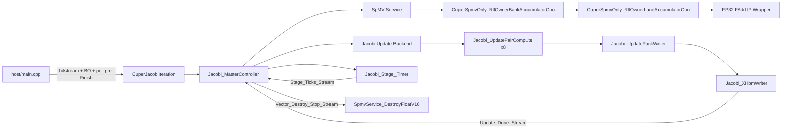
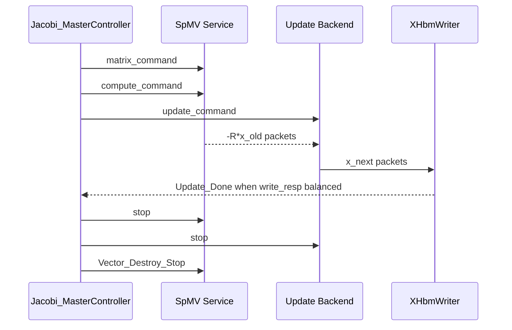

# project-xplus 中 Jacobi iteration 接入 lanereal16 blackbox 上板异常研究报告

## 执行摘要

在我对指定仓库 `yamato720/project-xplus` 的 Jacobi 实验目录、定制 RTL 目录、构建脚本、连线配置与调试文档做交叉核对后，一个很关键的事实先要说明：**我没有在当前仓库中直接检索到字面名为 `lanereal16` 的模块**；从功能、注释和构建脚本来看，最接近且最可能对应你所说“RTL、乱序执行”的实现，是 `verilog/tapa/CuperSpmvOnly_RtlOwnerLaneAccumulatorOoo.v`，以及其 bank 级封装 `CuperSpmvOnly_RtlOwnerBankAccumulatorOoo.v`。前者明确写明是 “owner-lane accumulator”，输入输出是带 tag 的标量/双浮点包，并使用“one FP32 adder pipeline + scoreboard”来做只阻塞真 RAW hazard 的乱序累加；后者则把 8 路固定 pair-lane 流汇总为一个 owner-bank 级模块，以保留“8-lane out-of-order accumulation”同时减少顶层 task/FIFO 数量。仓库中可见的 Jacobi 顶层仍然保留 16 路 HBM SpMV 数据通路，因此你口中的 “lanereal16” 更像是**这套 16 路 Jacobi/SpMV 体系里某个 owner-lane OOO 累加子系统的口头称呼**，而不是仓库中的真实文件名。citeturn23view0turn23view1turn23view2turn23view3turn24view0turn26view4turn32view0turn34view0turn13view0

更重要的是，当前仓库暴露出来的接入方式，**不像标准 Vitis HLS 的 JSON blackbox 流**，而更像是 **TAPA 先生成/分析 Jacobi 顶层，再在 `WORK_DIR/hdl/` 中用定制 Verilog 覆盖或替换生成 RTL，最后再交给 `v++ --link` 链接**。TAPA 官方文档的“Custom RTL Kernels”教程是通过 `[[tapa::target("non_synthesizable", "xilinx")]]` 与 `tapa pack --custom-rtl` 接入定制 RTL；而 AMD Vitis HLS 的官方 RTL blackbox 要求又是另一套规则：需要 C 函数签名、blackbox JSON、Verilog RTL、**唯一时钟、唯一高有效复位、CE 信号**以及受支持的 block-level / port-level 协议。你当前仓库中这个 RTL 子模块，裸接口却是 TAPA/生成 RTL 风格的 `ap_clk`、**低有效** `ap_rst_n`、`ap_start/ap_done/ap_idle/ap_ready` 与一组 `*_s_dout / *_empty_n / *_read`、`peek_*` 风格 FIFO 握手；所以如果你是把它“直接 blackbox 化”接进另一条 HLS 或板级工程，而没有做**薄适配 wrapper**，那么接口语义、复位极性和流水暂停语义不一致，极容易造成“仿真看着能跑、板上不工作”的现象。citeturn48view4turn40view0turn40view2turn40view3turn27view1

从仓库文档和脚本看，当前真实上板问题并不只是一类。仓库作者自己已经把主要风险指向了几类：**`Finish()` 不返回的 stream/dataflow 死锁、常驻 task 未退出、AXI mmap 请求/响应不平衡、stop/drain 协议不闭合、debug monitor 自己阻塞，以及 routed timing 未收敛导致的硬件异常状态**。在现有文档中，排查优先级被明确列为：先看 `Jacobi_XHbmWriter` 是否收齐 `X.write_resp` 并发出 stop feedback，再看 round dispatcher / round mux、update pair compute、链尾 `SpmvService_DestroyFloatV16`、debug monitor，最后才把未收敛 timing 作为单独方向。与此同时，仓库还记录了：`20260615-demo` 的 light-trace 全图在 **150 MHz** 数据时钟下 routed timing 收敛并完成 demo-only 上板，而 `20260617` 的 16 路 no-debug 版本服务器 smoke 已失败；`24` 路宽 HBM 实验则软件仿真能过，但 routed timing 未收敛且服务器 smoke 失败。这意味着如果你当前把 OOO RTL 重新 blackbox 化接板，**最需要优先确认的不是数学功能本身，而是接口/停机协议/时序收敛三者是否同时满足**。citeturn38view5turn38view6turn38view8turn20view0turn13view0turn48view0

还有一个非常容易被忽略、但我认为很“像根因放大器”的点：**仓库文档和实际连线配置存在漂移**。`cfg/README.md` 里写的是 `X0/X1` 映射到 HBM[22]/HBM[23]、`Status` 和 `Metrics` 在 HBM[24]；但实际 `cfg/connectivity.cfg` 可见的是单个 `X` 在 HBM[22]，而且 `Status` 与 `Metrics` 共享 HBM[24]；只有在 debug graph 的 link 脚本里，`Metrics` 才会被改写到 HBM[25]，并额外把 `Debug` 放到 HBM[26]。如果 host、bitstream、Debug ABI、脚本环境不是严格成套匹配，那么**板上行为不一致**很可能根本不是黑盒 RTL 算错，而是 **主机侧 buffer 分配/同步和 xclbin 内核 ABI 已经不一致**。citeturn15view1turn48view5turn36view11turn37view4turn37view5turn20view0

## 仓库中定位到的相关文件与关键证据

下表列出我在指定仓库中找到、并且对本问题最关键的文件。为了避免把长代码整段搬进来，我只保留最有载荷的短片段或行为摘要。所有路径都来自同一个指定仓库。citeturn13view0turn14view0turn15view1turn15view2turn24view0

| 路径 | 作用 | 与问题的关系 | 关键证据 |
|---|---|---|---|
| `verilog/tapa/CuperSpmvOnly_RtlOwnerLaneAccumulatorOoo.v` | owner-lane 级 OOO 累加 RTL | 最接近“lanereal16/owner-lane OOO”实现；协议、流水、tag、scoreboard 都在这里 | 文件注释明确写了输入/输出 tagged 协议，并说明使用 “one FP32 adder pipeline” 与 “a small scoreboard” 只阻塞同一 owner_group 与 ping/pong lane 上的真 RAW hazard。citeturn32view0turn26view4 |
| `verilog/tapa/CuperSpmvOnly_RtlOwnerBankAccumulatorOoo.v` | bank 级封装 | 把八路 owner-lane 核在 bank 内聚合；更可能是实际 blackbox 替换边界 | 注释明确写出 “keep local 8-lane out-of-order accumulation while reducing top-level task/FIFO count”。同时它在非 Verilator 路径中显式包含 fadd wrapper 与 support 头文件。citeturn34view0turn27view6 |
| `verilog/tapa/CuperSpmvOnly_RtlOwnerLaneAccumulatorOoo_support.vh` | 辅助宏/支持逻辑 | 若 blackbox 打包时漏掉此文件，综合或行为会与仿真不一致 | 被 bank 封装以 include 方式引入；说明它不是可有可无的附属文件。citeturn27view6 |
| `DLC/Cuper-jacobi-iteration/kernels/detail/cuper_jacobi_top_graphs.hpp` | Jacobi 顶层 task graph | 定位 Jacobi 控制边界、Update_Done、vector destroy、计时与 stop 路径 | 注释把 `Update_Done_Stream`、`X_Write_Stream`、`Vector_Destroy_Stop_Stream` 等关键流关系写得很明确，并指出 `Jacobi_MasterController` 是唯一轮次推进者。citeturn28view1turn28view3 |
| `DLC/Cuper-jacobi-iteration/kernels/detail/jacobi_controller.hpp` | 主控制器 | 每轮发 matrix/compute/update 命令并等待 `Update_Done_in.read()` | 控制器实现里可见每轮 `spmv_service_send_matrix_command`、`spmv_service_send_compute_command`、`Jacobi_SendUpdateCommand(...)`，然后阻塞等待 `const JacobiUpdateDone done = Update_Done_in.read();`。citeturn19view0 |
| `DLC/Cuper-jacobi-iteration/kernels/detail/jacobi_cuper_output_update.hpp` | update 后端、pack writer、X 写回相关 | 若 pair compute / pack writer / X writer 任一端口握手失衡，就会出现板上挂死或错误结果 | 代码与文档都显示 `Jacobi_UpdatePairCompute`、`Jacobi_UpdatePackWriter` 与 `X_Write_out` 是多级链路，`mask_padding_lanes` 之后才 `X_Write_out.try_write(x_next)`。citeturn28view5turn28view6 |
| `DLC/Cuper-jacobi-iteration/scripts/build_xo_u55c.sh` | XO 构建脚本 | 明确证明当前流是 TAPA + custom RTL 覆盖，而不是标准 HLS JSON blackbox | 当 `JACOBI_SPMV_OOO_ACCUMULATE_RTL=1` 时，脚本把 `CuperSpmvOnly_RtlOwnerBankAccumulatorOoo.v`、`CuperSpmvOnly_RtlOwnerLaneAccumulatorOoo.v`、fadd wrapper 与 support 文件一起送入构建；`tapa ... synth --clock-period "$CLOCK_PERIOD"` 也是直接可见的。citeturn37view1turn37view2turn48view4 |
| `DLC/Cuper-jacobi-iteration/scripts/link_xclbin_u55c.sh` | xclbin 链接脚本 | 链接频率、connectivity、Debug ABI 分裂都在这里 | 可见 `v++ --link --target hw --platform "$XPLATFORM" --config "$CONNECTIVITY_CFG"`，并在 debug 图上默认 `JACOBI_KERNEL_FREQUENCY=150`；脚本注释还明确说“v++ 2022.2 这里用 MHz”。citeturn48view0turn48view2turn48view3 |
| `DLC/Cuper-jacobi-iteration/cfg/connectivity.cfg` | memory banking 配置 | 这是仓库可见的**唯一**链接配置文件；不是 XDC，不能替代时序约束 | `[connectivity]` 里只定义 `nk=` 和 `sp=`，例如 `Matrix_data_0..15 -> HBM[0..15]`，`X -> HBM[22]`，`Status/Metrics -> HBM[24]`。citeturn48view5turn36view11turn36view12 |
| `DLC/Cuper-jacobi-iteration/host/main.cpp` | host 运行逻辑与 pre-Finish 观测 | 板上挂死时可用来判断是结果未写回还是 `Finish()` 收尾没退 | host 在 `instance.Finish()` 之前有 pre-Finish snapshot/poll 逻辑，并打印 “kernel status visible before Finish” 与 “after ReadFromDevice before Finish”。citeturn29view0turn29view1turn29view9 |
| `DLC/Cuper-jacobi-iteration/docs/testing.md` | 测试现状 | 记录哪些版本上板通过、哪些版本 timing 未收敛 | light-trace 完整图已上板通过；24 路宽 HBM artifact build 完成但 timing 未收敛；16 路 no-debug 在服务器 smoke 失败。citeturn20view0 |
| `DLC/Cuper-jacobi-iteration/docs/finish_nonreturn_monitoring_points.md` | Finish 不返回根因清单 | 给出了最值得优先检查的板上挂死路径 | 文档把 `stream/dataflow deadlock`、常驻 task 未退出、AXI mmap 请求/响应不平衡、stop/drain 不闭合、debug task 自己卡住列为首要候选。citeturn38view5 |
| `DLC/Cuper-jacobi-iteration/docs/hardware_finish_hang_fix_suggestions.md` | 特定 corner case 修复建议 | `R NNZ = 0` / `Matrix_len = 0` 时的空 batch 死锁，是一个已知硬件坑 | 文档明确指出 `Batch_num=0` 会让 vector 包无人消费，最终表现为 `Finish` 挂住，并推荐优先做 diagonal-only bypass。citeturn20view1 |

下面这几段短片段最能反映“问题长什么样”。

```verilog
// one FP32 adder pipeline ...
// a small scoreboard blocks only true RAW hazards
```

这不是普通顺序累加器，而是**带 tag 的乱序、受 hazard 限制的累加流水**。如果 blackbox 适配层对输入顺序、valid 停顿、tag 对齐的理解稍有偏差，板上通常先坏在“偶发错值”或“只在高并发时挂死”，而不是稳定复现的纯功能错误。citeturn32view0turn26view4

```cpp
spmv_service_send_matrix_command(Matrix_Command_out);
spmv_service_send_compute_command(Command_out);
const JacobiUpdateDone done = Update_Done_in.read();
```

Jacobi 控制器对每轮完成的判断是**阻塞式等待 update done**。因此只要 update 后端、pack writer、X 写回或其 write response 少一个，就会把整个 graph 卡死在控制器收尾路径。citeturn19view0

```bash
tapa ... synth --clock-period "$CLOCK_PERIOD"
v++ --link ... --config "$CONNECTIVITY_CFG" --kernel_frequency "$JACOBI_KERNEL_FREQUENCY"
```

这说明 visible flow 的关键参数是 **TAPA 综合时钟周期** 与 **v++ 链接频率** 两层共同决定，而 `connectivity.cfg` 只负责 memory banking，不负责真正的时钟/XDC 时序例外。citeturn37view2turn48view3

## 模块关系、协议边界与 blackbox 风险点

从 Jacobi 顶层图和脚本推回去，当前设计更像下面这条链路。这里我把最关键的 RTL / HLS / host 边界合并成一张图，方便后面定位问题。citeturn28view1turn28view3turn37view2turn48view3



### 接口与协议

`CuperSpmvOnly_RtlOwnerLaneAccumulatorOoo.v` 的裸模块接口不是 AXI4-Stream，也不是一个简单的 HLS `hls::stream` 黑盒模板，而是包含 `ap_clk`、**低有效** `ap_rst_n`、`ap_start/ap_done/ap_idle/ap_ready`，加上 `Owner_Lane_Stream_s_*`、`Owner_Lane_Stream_peek_*`、`Vector_Y_Tagged_Stream_s_*` 这类**自定义 FIFO/peek 握手**的生成 RTL 风格接口。它还带了 `Owner_id` 和 `Pair_lane` 之类的静态参数/标量输入。也就是说，这个 RTL 之所以能在当前工程里运行，是因为**它被嵌在 TAPA 生成的那套约定俗成的 wrapper 语义里**；如果你把它原封不动拿去做另一种 blackbox 接入，必须先确认新的包装层是否同时满足：复位极性、start/ready 生命周期、FIFO `empty_n/read` 采样时序、以及 `peek` 通道的“窥视不出队”语义。否则问题不会体现在“综合报错”，而会表现成**板上偶发无响应或结果乱序**。citeturn27view1turn40view3

这也是为什么我不建议把这个模块“裸接”到标准 Vitis HLS RTL blackbox 上。AMD 官方 RTL blackbox 机制明确要求：Verilog RTL 必须提供**唯一 clock、唯一高有效 reset、CE**，并且只能使用受支持的 block-level / port-level 协议；而当前 owner-lane RTL 是 TAPA/生成 RTL 风格，复位极性也是反的。最稳妥的做法是：**保留现有 RTL 内核不动，加一层极薄 wrapper**，在 wrapper 内做 reset 极性转换、CE 映射、以及 stream/FIFO 协议语义对齐，把 wrapper 作为 blackbox 暴露给 HLS / Vitis，而不是把原模块直接作为 blackbox。citeturn40view3turn27view1

### 乱序执行实现细节

owner-lane RTL 的注释本身就已经把设计意图说得很直白：输入是带 `scalar_lane/pair_lane/packet_idx/done` tag 的 `TaggedScalar`，输出是带 `value0/value1/pair_lane/packet_idx` tag 的 `TaggedFloatV2`；性能版通过**一个持续推进的 FP32 adder pipeline** 和一个**小 scoreboard** 来保证只在“同 owner_group + 同 ping/pong lane”发生真 RAW hazard 时停顿，其余独立行可以每拍进入。换句话说，这个模块不是传统 ROB 全局重排，而是更轻量的**tag-sideband + scoreboard 局部乱序累加**。如果 blackbox 接入让 adder latency、tag shift、读写 RAM 回读时机、或 stall 条件偏移一拍，结果就会错写到错误的 ping/pong 位或错误 packet。citeturn32view0turn26view4turn27view3turn27view4

一个非常关键的仓库证据，是 lane RTL 里对仿真模型差异的备注：当前“轻量模型只用于 Verilator 协议仿真”，真实 Vitis floating-point IP 在当前 wrapper 下相对 issue tag 是 **12 拍**；如果这里直接取 `pipe[NUM_STAGE-1]`，Verilator 会比 xsim/IP **晚一拍**，具体表现就是“scalar0 的结果被 scalar1 的 pong tag 写回”。这条注释说明**仓库作者已经遇到过行为模型与真实 IP/网表之间的 tag/延迟错位**，只是他们把它限定在 Verilator 协议仿真语境里。对你当前的 blackbox 上板问题来说，这条证据的含义是：**只看行为级仿真通过，完全不能证明这个 OOO 累加 RTL 在板上 tag 对齐一定正确**。你必须做至少一次 post-synth / post-impl 网表级验证。citeturn26view3turn46search1turn46search2

### 顶层控制与停机路径

Jacobi 顶层图的注释已经把控制依赖写得很清楚：`Jacobi_MasterController` 是**唯一轮次推进者**；它发出 matrix/compute/update 命令，等待 `Update_Done_Stream`，而 `Update_Done_Stream` 又来自 `Jacobi_XHbmWriter` 在“当前轮 X write response 已收齐”之后的反馈。与此同时，链尾还有独立的 `Vector_Destroy_Stop_Stream` 控制 `SpmvService_DestroyFloatV16` 去 drain 尾部数据。这意味着只要 X 写回应答、pack writer、pair compute、或尾部 drain 中有一环少一个包，控制器就可能永远等不到完成条件。仓库自己的调试文档也正是把 `XHbmWriter` 收齐 `X.write_resp`、round mux/dispatcher、detached update pair compute、链尾 destroy、debug monitor 列为首要排查顺序。citeturn28view3turn19view0turn38view5turn38view6

用时序图表示，本轮控制关系大致像这样。这个图是依据仓库控制器注释与实现抽象出来的，不是逐拍 RTL 波形。citeturn19view0turn28view3



### 构建、约束与仿真流

仓库的 visible flow 里，看得到的是 `tapa ... synth --clock-period "$CLOCK_PERIOD"` 与 `v++ --link --config "$CONNECTIVITY_CFG" --kernel_frequency "$JACOBI_KERNEL_FREQUENCY"`；`connectivity.cfg` 里只有 `[connectivity]`、`nk=` 和 `sp=`，用于 HBM bank 绑定。**我在本次仓库可见路径中没有看到显式用户 XDC 被纳入这条 Jacobi 链接脚本。** 这通常意味着：如果你走的是 Vitis 平台流，很多板级时钟/IO 约束由平台 `.xpfm` 与下游 Vivado BD 提供；但如果你绕开平台、或者在 blackbox 包装层上新增了时钟、异步复位、板外 IO，就不能假设 `connectivity.cfg` 会替你补上 `create_clock`、`set_input_delay`、`set_output_delay`、`set_clock_groups` 或 CDC 例外。AMD 官方文档也明确区分：`create_clock` 是定义主时钟的基础，I/O delay 需要明确建模，异步 CDC 通常推荐用 `set_clock_groups -asynchronous` 或在必要时用更细粒度 timing exception，未约束路径必须在 signoff 时清零。citeturn48view3turn48view5turn43search4turn43search1turn43search3turn42search11turn42search14turn45search1turn45search3

官方仿真建议也和你当前问题高度相关。Vivado UG900 明确指出：**post-synthesis / post-implementation timing simulation 只有 Verilog timing sim 才支持 SDF 注入**；post-implementation timing sim 才能用真实布局布线后的延迟检查功能与时序错误；进行 timing sim 时，Vivado 生成的 timing netlist 会包含 `$sdf_annotate`，并且推荐分别用 slow/max 做 setup 检查、fast/min 做 hold 检查。对你这种“Vivado 生成的 .v 仿真文件与板上行为不一致”的问题，这一步不是可选项，而是必须做的分辨实验。citeturn46search1turn46search2turn46search7

## 可能导致板上失败的原因排序

下面的排序综合了两类权重：一类是**仓库内部证据强度**，另一类是**对你当前“blackbox 接板不正确运行”症状的解释力**。我把“概率”和“可验证性”一起考虑了；排在前面的，不一定绝对最致命，但一定是**最值得先查**的。citeturn38view5turn38view6turn38view8turn20view0

| 排名 | 可能原因 | 为什么我把它排这么高 | 最快验证方法 |
|---|---|---|---|
| 高 | **stop/drain / write response 不平衡，导致 `Finish()` 或上层收尾卡死** | 仓库文档明确把 stream deadlock、常驻 task 未退出、AXI mmap 请求/响应不平衡、stop/drain 不闭合列为首要候选；优先级表又把 `Jacobi_XHbmWriter`、round mux/dispatcher、tail destroy、debug monitor 放在最前。citeturn38view5turn38view6 | 用当前 host 的 pre-Finish snapshot；再在 ILA 上抓 `X.write_req/write_resp` 对应计数、`Update_Done`、尾部 drain 相关 valid/empty。若 status 可见而 `Finish()` 不返，优先怀疑收尾而非数学错误。citeturn29view0turn29view9 |
| 高 | **把 TAPA 生成 RTL 风格模块直接当 HLS/Vitis blackbox 接入，接口语义不一致** | 当前 RTL 裸口是 `ap_clk/ap_rst_n/ap_start/...` + `*_empty_n/read` + `peek_*`，并不是通用 AXIS；AMD RTL blackbox 又要求高有效 reset、CE 和受支持协议。直接裸接很危险。citeturn27view1turn40view3 | 给黑盒前面套一层薄 wrapper：把 reset 极性、CE、FIFO 语义、stall 行为显式适配；然后比较 wrapper 前后板上结果。若 wrapper 版恢复，根因基本坐实。 |
| 高 | **时序未收敛或链接频率/综合周期与板上运行频率不一致** | 仓库已记录 light-trace 版在 150 MHz 下 routed timing 收敛；no-debug / wide-HBM 版则出现 smoke 失败或 timing 未收敛。脚本同时存在 `CLOCK_PERIOD` 与 `--kernel_frequency` 两套频率控制。citeturn20view0turn37view0turn48view0turn48view2 | 导出并核查 `report_timing_summary`、`check_timing`、`report_methodology`、`report_cdc`；先把 build 降到已知可行的 150 MHz / 4ns 再看问题是否消失。citeturn45search0turn45search3turn45search6turn42search1 |
| 中高 | **行为仿真模型与真实 vendor IP / timing netlist 存在一拍级 tag/latency 偏移** | lane RTL 源码已明说 Verilator 轻量模型与真实 floating-point IP 延迟存在一拍差异，甚至会造成 tag 写错位。citeturn26view3 | 跑 post-synth/post-impl timing sim，slow/max 与 fast/min 都做；再把 owner-lane 模块单独拉出来跑 xsim，对比行为仿真与网表仿真。citeturn46search1turn46search2 |
| 中高 | **host / xclbin / connectivity / Debug ABI 不匹配** | 仓库 README、cfg README、实际 connectivity、debug link 脚本之间有明显漂移；debug graph 会把 `Metrics` 挪到 HBM[25]，再新增 `Debug` 到 HBM[26]，而普通 cfg 又不是这个布局。citeturn15view1turn36view11turn37view4turn37view5turn20view0 | 固定一套 host + xclbin + 配置脚本版本。跑前先打印 `Status[0..2] / Metrics[0..7]` 的 pre-Finish snapshot，确认 host 看到的 buffer 内容与当前 ABI 对齐。citeturn29view1turn29view9 |
| 中 | **`R NNZ=0` / `Matrix_len=0` 导致空 batch，vector 包无人消费** | 仓库已单独写文档说明：`Batch_num=0` 对 service 化 Cuper SpMV 不安全，会让 vector loader 先发包而 core 不消费，最终 `Finish` 挂住。citeturn20view1 | 用 `thermal2_n16` 或任何 `R NNZ=0` case 单测；若只在这种 case 挂，优先做 diagonal-only bypass。 |
| 中 | **工具链版本/环境不一致导致 IP、xclbinutil、仿真脚本行为变化** | 脚本直接写明 “v++ 2022.2 这里用 MHz”，并且特地 `env -u XILINX_XRT` 以规避本机 XRT 2.18 带来的 `xclbinutil` 依赖问题；TAPA README 又写明需要 Vitis HLS 2022.1+。citeturn48view0turn48view3turn40view1 | 固定工具链：先用仓库预期的 Vitis/Vivado 2022.2 附近版本复现，再升级/降级。对同一 DCP 比较 netlist 与报告，不要混用不同版本生成的 RTL / IP / xclbin。 |

### 建议的最小验证矩阵

这个表的目的，是把“先做什么，能排掉什么”压缩成最小实验集合。citeturn20view0turn38view6turn46search1turn45search3

| 实验 | 目标 | 若通过，说明什么 | 若失败，首先怀疑什么 | 优先级 |
|---|---|---|---|---|
| software regression | 先排掉数学功能与 host 基线 | 纯算法和数据准备大致无误 | host 侧矩阵拆分/ABI 就已错 | 很高 |
| owner-lane / bank RTL 单元级 xsim | 核对 OOO 累加协议与 tag | 黑盒 RTL 自身在真实 simulator 下基本一致 | latency/tag/wrapper 先有问题 | 很高 |
| post-synth timing sim | 看综合后功能是否漂移 | 黑盒 RTL 与综合逻辑仍一致 | 黑盒映射、IP 包装或综合优化引入偏差 | 很高 |
| post-impl timing sim + SDF | 看布局布线后是否才坏 | 板上更像板级/环境问题 | 真实时序/CDC/约束问题 | 很高 |
| light-trace 150 MHz 再上板 | 对照已知好路径 | 当前 host/bitstream/板环境基本可用 | 新 blackbox/wrapper/ABI 造成问题 | 很高 |
| one-round debug top | 切开 feedback/stop 链 | 主数据路径基本没问题 | 收尾路径或主路径仍有问题 | 高 |
| diagonal-only case | 检查空 batch corner | 空矩阵特例已处理好 | `Matrix_len=0` / `Batch_num=0` 引发死锁 | 中 |

## 详细调试与修复清单

下面这部分我尽量写成**可以直接照着做**的清单。老师如果只想先做最短路径，先看“最短闭环”。后面再补增量实验。citeturn20view0turn38view6turn41view5turn47search15

### 最短闭环

先把变量冻结成一条**仓库内部已知最接近可工作的路径**：`CuperJacobiIteration`、16 路、`JACOBI_TRACE_LIGHT=1`、较保守频率（脚本默认 debug 图 150 MHz、综合周期 4ns 更保守），然后不要同时改 host、wrapper、connectivity、板卡环境。仓库记录表明 light-trace 全图是当前最接近“已知成功”的参考点。citeturn20view0turn37view0turn48view0

接着跑仓库已有的软件回归，至少覆盖一个小矩阵和一个 `thermal2` 用例。测试文档已经给了现成命令，例如：

```bash
make cuper-jacobi-regression-sw MODE=quick
make cuper-jacobi-build-host MAX_ITERS=2
make cuper-jacobi-run-sw MATRIX=DLC/Cuper-jacobi-iteration/data/matrices/cant.mtx MAX_ITERS=1
```

这些命令的意义不是“证明板上没问题”，而是把**矩阵拆分、host 侧 reference、Status/Metrics ABI**先固定下来。citeturn20view0

如果你当前不是沿用仓库脚本，而是自己把 owner-lane/bank RTL 通过 blackbox 接到另一条 HLS/Vitis 流，请立刻做一层 wrapper，把接口标准化。最简单的 wrapper 原则是：外部只暴露一个高有效 `rst`、一个 `clk`、一个 `ce`、一组明确的 FIFO/AXIS 语义；内部再去翻译到原模块的 `ap_rst_n`、`ap_start`、`*_empty_n/read`、`peek_*`。**不要**把原模块直接暴露给 HLS blackbox。AMD 的官方 blackbox 约束和当前模块实际接口不是同一套语言。citeturn40view3turn27view1

### 仿真与时序注入

在 Vivado/XSim 里，不要只停留在行为仿真。UG900 说得很明确：post-synthesis 与 post-implementation timing simulation 可以生成 Verilog timing netlist 与 SDF，并用 slow/max、fast/min 分别检查 setup/hold。对于你这种“`.v` 仿真文件和板上不一致”的问题，**post-impl timing sim 是最有区分力的实验**。citeturn46search1turn46search2

推荐最小 Tcl 流程如下：

```tcl
open_run impl_1
write_verilog -mode timesim -sdf_anno true impl_timesim.v
write_sdf -process_corner slow impl_slow.sdf
write_sdf -process_corner fast impl_fast.sdf

report_timing_summary -file post_route_timing.rpt
check_timing -verbose -file check_timing.rpt
report_methodology -file methodology.rpt
report_cdc -file cdc.rpt
report_clock_interaction -file clocks.rpt
```

如果你用 xsim 做 timing sim，UG900 还特别提醒 Vivado simulator 的 interconnect delay 需要相应选项，典型要加 `-transport_int_delays -pulse_r 0 -pulse_int_r 0` 一类参数；如果导出第三方仿真脚本，则 `export_simulation` / `export_ip_user_files` 要先把 IP 输出产物补齐。citeturn46search1turn41view1turn42search1turn45search3

此外，仓库里还有一个非常值得利用的点：`verilog/scripts/run_tapa_corestrip_xsim.tcl` 已经给出了一个独立 xsim 工程脚本，它显式要求 `TAPA_RTL_DIR`、`XSIM_BUILD_DIR` 和 `VIVADO_PART`，默认 part 还是 `xcu55c-fsvh2892-2L-e`。虽然它是给 `CoreStrip` 用的，但它提供了一个模板：**把最可疑的定制 RTL 单独拉出去做 xsim 工程，而不是每次都拖着整套 Jacobi 图跑**。citeturn31view0turn30view2

### 约束与 XDC 建议

先说清楚：`cfg/connectivity.cfg` **不是 XDC**。它只做 kernel 数量和 bank 绑定；不能代替时钟、IO delay、CDC 例外、multicycle 约束。仓库当前可见的 link 命令也只把 `--config "$CONNECTIVITY_CFG"` 传给 `v++ --link`，并没有在脚本里看到用户自定义 XDC 注入。citeturn48view3turn48view5

如果你走的是标准 Vitis 平台流，板级主时钟、平台内核时钟、HBM/DDR/AXI infrastructure 很多约束可能由平台提供；但**只要你在 blackbox wrapper 层自行引入了新时钟、新异步复位、或平台外 IO**，就必须补充用户约束。UG903/UG949 的建议可以直接转成下面这些检查动作。citeturn43search4turn43search1turn43search3turn42search11turn42search14turn41view5

建议的 XDC 框架如下：

```tcl
# 主时钟
create_clock -name ap_clk -period 6.667 [get_ports ap_clk]    ;# 150 MHz 示例

# 若 blackbox 有板外输入/输出，必须给 I/O delay
# 下面只是模板，数值必须按板卡与外设时序手册填写
create_clock -name ext_clk_virt -period 6.667
set_input_delay  -clock ext_clk_virt <minmax> [get_ports data_in[*]]
set_output_delay -clock ext_clk_virt <minmax> [get_ports data_out[*]]

# 真异步 CDC 才能切掉；优先 clock_groups，其次精准 false_path
set_clock_groups -asynchronous \
  -group [get_clocks clk_a] \
  -group [get_clocks clk_b]

# 若确实是 multicycle，setup/hold 必须成对设置
set_multicycle_path 2 -setup -from <src> -to <dst>
set_multicycle_path 1 -hold  -from <src> -to <dst>
```

这里有三个容易踩坑的地方。第一，UG903 说明异步域通常推荐 `set_clock_groups -asynchronous`，而不是随手大范围 `set_false_path`；第二，UG906 说明如果你只加了 multicycle setup，没有补 hold，报告里经常会出现“不正常的小 setup requirement 或正 hold requirement”，这是典型错约束信号；第三，未约束路径必须在 signoff 前清零，尤其要检查 `NONE` / 空时钟名的路径。citeturn42search11turn42search14turn45search16turn45search1turn45search3

### ILA / VIO 捕获方案

如果老师现在最想做的是“尽快知道卡在哪一段”，那我建议上 ILA，而且**先抓控制边界，不要一口气抓整个数学数据面**。AMD UG908 明确建议：ILA 时钟必须选**自由运行时钟**，否则设计上板后可能根本连不上 debug core；同时 probe 宽度和深度要克制，否则 ILA 自己就会恶化 timing。citeturn47search15

我建议第一轮只放一组 control ILA，时钟接 Jacobi 主时钟，探针优先抓这些：

| 组别 | 建议信号 | 目的 |
|---|---|---|
| 控制器 | `ap_start/ap_done/ap_ready`、`Update_Done_Stream`、stage event/tick | 判断是不是控制器一直在等完成 |
| X 写回 | `X write request/response` 计数、写地址、done 发出点 | 判断是否卡在 `write_resp` 收尾 |
| 链尾销毁 | `Vector_Destroy_Stop`、tail drain consumed/returned | 判断 stop 发出后链尾是否真的 drain 完 |
| owner-lane 黑盒 | `Owner_Lane_Stream_empty_n/read`、`peek_empty_n/read`、输出 valid/full | 判断 blackbox 实际有没有前进 |
| OOO 核内部 | `issue_fire`、`fadd_advance`、`pipe_valid[last]`、`ping/pong wr_en` | 判断是不是 tag/latency 或 hazard 卡住 |

第二轮再加 VIO，只做少量可控注入，例如单步使能、强制 `ap_start`、或者把某个 debug abort/watchdog 信号拉高。UG908 还提供了 “Trigger at Startup” 机制，如果你的问题出现在很早的启动阶段，可以把 ILA 预先武装到 bitstream 里。citeturn47search7turn47search15

如果你已经有 routed design checkpoint，而只是想换几个关键信号做探针，不一定要重改 RTL。UG908 支持在 placed-and-routed DCP 上通过 ECO flow 换 debug probes，这对定位收尾挂死很有用。citeturn47search9

### 仓库已有调试点怎么利用

当前 host 已经支持 pre-Finish snapshot，所以板上第一步根本不用等程序完整退出。只要 host 还能从设备把 `Status`/`Metrics` 读回来，就能先区分“**算完了但 graph 不退**”和“**主数据路径根本没走完**”。仓库文档甚至建议：如果内部 watchdog 很难优雅收尾，优先做 native XRT debug host，先启动 kernel、睡眠或轮询几秒、再在 kernel 仍运行时把 Debug BO 拉回来看 snapshot。citeturn29view1turn29view9turn38view6

`finish_nonreturn_monitoring_points.md` 还给了很实用的分层思路：每个 task 记录 phase、progress、wait_code、mmap req/resp、stop_seen、done_seen；然后逐层判断是 core 没消费完矩阵、pack writer 没产够、XHbmWriter 没收齐响应，还是 debug monitor 自己没退出。这个文档其实已经把 ILA/VIO 的探针需求写成“字段规范”了，你完全可以按它的槽位定义去设计硬件 debug counters。citeturn37view7turn38view2turn38view5

### 针对本问题的修复优先顺序

如果只允许我给出一个最实用的修复顺序，我会建议按下面这个顺序来：

首先，把当前接法改成**薄 wrapper + 已知可收敛频率 + light-trace ABI**，只保留最少改动。然后做 post-impl timing sim。之后，如果 timing sim 与板上都表现为挂死，再优先盯 `write_resp / Update_Done / tail destroy` 这条收尾链，而不是一开始去怀疑数学正确性。最后，若只在 `R NNZ=0` 或很小矩阵上挂，再做 diagonal-only bypass。这样能最快把问题从“黑盒协议/网表/约束”与“算法 corner case”中分离出来。这个顺序和仓库文档的优先级判断基本一致。citeturn38view6turn20view1turn20view0

为了便于执行，我把命令层面的动作也压成一张表。这里有些命令是仓库原有的，有些是我建议新增的 Vivado Tcl 检查。citeturn20view0turn48view3turn46search2

| 动作 | 命令/做法 | 目标 |
|---|---|---|
| 软件基线 | `make cuper-jacobi-regression-sw MODE=quick` | 先固定 host/算法/ABI |
| 保守综合 | 让 Jacobi full graph 走 `CLOCK_PERIOD=4.0` 或等价 150 MHz 路线 | 先排 timing 噪声 |
| 强制定制 RTL | `JACOBI_SPMV_OOO_ACCUMULATE_RTL=1` | 确认确实使用了当前 custom RTL 路径 |
| 链接检查 | 查 `v++ --link ... --config ... --kernel_frequency ...` 实参 | 确认频率与 connectivity |
| 时序签核 | `report_timing_summary` / `check_timing` / `report_methodology` / `report_cdc` | 查未约束路径、CDC、methodology、WNS/TNS |
| timing sim | `write_verilog -mode timesim -sdf_anno true` + `write_sdf` | 查行为/网表/布局布线差异 |
| ILA 首轮 | 抓 `Update_Done`、`X.write_resp`、tail destroy、owner-lane 输入输出握手 | 快速判断卡段 |
| corner case | 用 `R NNZ=0` case 单测 | 排查空 batch 死锁 |
| ABI 对齐 | 固定 light-trace / no-debug / debug graph 中的一套 host+bitstream+cfg | 避免漂移误判 |

## 替代实现建议

如果你希望“先上线一个稳定版，再慢慢把 OOO 性能找回来”，我建议不要把所有风险都压在同一个 blackbox 接口上。下面几种替代方案，从“保守稳定”到“保留性能”逐渐递进。前两项通常最值得先做。citeturn40view3turn20view1turn38view6

| 方案 | 说明 | 风险 | 工作量 | 适用场景 |
|---|---|---:|---:|---|
| 薄 wrapper 规范化接口 | 保留现有 owner-lane / bank RTL，不改核心逻辑，只把外部接口统一成高有效 reset、明确 ce、确定 FIFO 语义 | 低 | 低到中 | 当前 blackbox 接口不稳，但你不想重写 RTL |
| 关闭 OOO，先回退到纯 HLS/顺序累加版本 | 先验证 Jacobi 整体图、host ABI、板级流是否稳定，再重新引入 OOO | 低 | 中 | 你现在优先要“板上一定能跑” |
| 保留 bank 级封装，取消 lane 级乱序 | 用 bank 级聚合减少顶层复杂度，但把 owner-lane 改成顺序累加或单 in-flight | 中 | 中 | 想保留部分结构收益，同时降低 tag/scoreboard 风险 |
| one-round debug top | 只跑一轮，`XHbmWriter` 收齐响应后直接写状态，不经过完整 feedback/stop 环 | 低 | 低到中 | 判断主路径是否通、问题是否在 finalization |
| diagonal-only bypass | 对 `R NNZ=0`/`Matrix_len=0` 走专门旁路，不复用 SpMV service 空 batch | 低 | 低 | 小矩阵或对角矩阵特例常挂 |
| 彻底改成标准 Vitis HLS blackbox JSON 流 | 用 AMD 官方黑盒流程重包一遍 | 中到高 | 中到高 | 你准备长期维护、并希望工具链语义更统一 |

我个人更推荐的路线是：**先做薄 wrapper，再做 one-round debug top，再决定是否保留 OOO**。原因很简单：当前最可疑的不是“OOO 算法思想”本身，而是**OOO RTL 与现有 build/link/runtime 语义之间的边界**。把边界先缝牢，后面无论保留性能版还是回退简化版，都会容易很多。这个判断与仓库里“先让失败能返回、再做 one-round debug top”的调试策略是同向的。citeturn38view6

## 假设与未指定项

当前请求里没有明确给出 FPGA 型号、板卡型号、Vivado/Vitis 具体版本。我在仓库可见证据里能确认的只有：脚本文件名直接指向 **U55C**，`run_tapa_corestrip_xsim.tcl` 的默认 part 是 `xcu55c-fsvh2892-2L-e`，link 脚本注释显式提到了 **v++ 2022.2** 的 `--kernel_frequency` 语义与 XRT 环境冲突规避。换句话说，下面这份报告最贴近的默认前提是：**U55C 平台、Vitis/Vivado 2022.2 附近、TAPA 2022.1+ 工具链语义**。如果老师实际使用的是别的板卡或更高/更低版本，很多现象会变。citeturn30view2turn48view0turn48view3turn40view1

如果板卡不是 U55C，而是普通开发板、PCIe 卡、或者没有 AMD 平台 `.xpfm` 的裸板，那本报告里“可见 flow 没有显式用户 XDC”这件事就要重新理解：在 U55C 平台流里，这可能只是平台代管；但在裸板流里，这通常就意味着你必须自己补 `create_clock`、I/O 时序、CDC 例外与必要的 multicycle。UG903/UG949 对这些约束的要求并不会因为 blackbox 而消失。citeturn43search4turn43search1turn43search3turn42search11turn42search14turn41view5

如果 Vivado/Vitis 版本不是 2022.2，而是 2023.x/2024.x/2025.x，至少要重新检查三件事：floating-point IP latency 是否与当前 wrapper 假设一致，xsim timing sim 选项/库文件是否变化，`v++` 对频率、平台与 xclbin 打包工具的行为是否变化。因为你当前的 owner-lane OOO RTL 本身就对 tag/latency 对齐很敏感，所以**版本漂移不会只影响性能，可能直接影响功能一致性**。官方文档虽然没有针对你这个定制模块说话，但它已经明确说明 timing sim、SDF、CDC 报告、未约束路径检查这些步骤属于签核必要条件。citeturn26view3turn46search1turn42search1turn45search3

综合来说，我对这个问题的结论是：**最像根因的不是单一的“blackbox 不能跑”，而是 TAPA 风格定制 OOO RTL 被以不完全兼容的 blackbox 方式接入后，又叠加了收尾链路和时序收敛两个高风险点**。先把 wrapper 规范化、再用 post-impl timing sim 和 ILA 把 `Update_Done / X.write_resp / tail destroy` 三个点钉死，通常就能很快把问题由“玄学上板失败”变成一个可以复现、可以修的确定性缺陷。citeturn40view3turn38view6turn46search1turn47search15